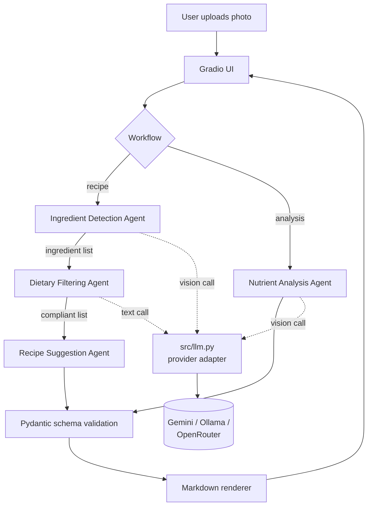

# nutrition-bot

An AI nutrition coach: photograph a meal and get a nutrient
breakdown, or photograph your ingredients and get recipes that
respect your dietary restriction.

Built as a **CrewAI multi-agent system** with a **provider-agnostic
LLM layer** — it runs on a free Gemini key, on a fully offline
Ollama install, or on OpenRouter, selected by one environment
variable.

---

## Why the provider layer matters

Most multi-agent tutorials hardcode one vendor SDK, so the code only
runs where the tutorial ran. Here every model call goes through
`src/llm.py`. Switching backend is this:

```bash
LLM_PROVIDER=gemini    # free tier, has vision
LLM_PROVIDER=ollama    # fully offline, free forever, no key
```

| Provider | Vision | Cost | Notes |
|---|---|---|---|
| `gemini` | yes | free tier | Default. Key from Google AI Studio. |
| `ollama` | yes | free | Local `llava` + `llama3.1`. No network. |
| `openrouter` | varies | free tier | `:free` model list rotates. |

---

## Architecture



**Recipe workflow** — three agents in sequence: detect what is in the
photo, drop anything that breaks the restriction, then build recipes
from what survives.

**Analysis workflow** — one agent, one vision call. It is a single
agent on purpose: a modern vision model does this in one shot, and
adding agents for the sake of the diagram would only add latency.

---

## Quick start

**Requires Python 3.10 - 3.13.** CrewAI does not support 3.14
yet. Check with `python3 --version`; if you are outside that range
see [Troubleshooting](#troubleshooting).

```bash
git clone https://github.com/bmache/nutrition-bot.git
cd nutrition-bot

python3.12 -m venv venv        # any 3.10-3.13 interpreter
source venv/bin/activate
pip install -r requirements.txt

cp .env.example .env
# add your GEMINI_API_KEY (https://aistudio.google.com/apikey)

python app.py
# -> http://127.0.0.1:7860
```

### Fully offline instead

```bash
ollama pull llava
ollama pull llama3.1
# in .env:  LLM_PROVIDER=ollama
python app.py
```

No key, no network, no bill.

---

## Project layout

```
app.py               Gradio UI, thin - delegates everything
src/llm.py           provider adapter (the core abstraction)
src/crew.py          agent + task wiring, two crews
src/tools.py         agent tools; pure logic split from wrappers
src/prompts.py       prompt templates, isolated from logic
src/models.py        Pydantic output schemas
src/formatting.py    crew output -> Markdown
src/config/*.yaml    agent roles and task descriptions
tests/               unit tests, no API key needed
```

---

## Design decisions

| Decision | Why |
|---|---|
| All model calls go through `src/llm.py` | Keeps vendor SDKs out of the rest of the codebase, so changing provider is a config change. |
| Explicit `llm=` on every agent | Without it CrewAI defaults to OpenAI and fails with an auth error for a provider you never configured. |
| Plain classes instead of `@CrewBase` | Easier to read and to instantiate in tests. The decorators inject an `__init__` and memoise methods, which hides the wiring. |
| Pure functions separate from `@tool` wrappers | Lets the tests import the logic directly and run with no API key and no network. |
| `context=[...]` for task chaining | The supported way to pass one task's output to the next. `depends_on` and `input_data` are not real `Task` parameters. |
| `to_dict()` tries several output shapes | CrewAI returns output differently across versions. If none match, the raw text is shown instead of raising. |
| Analysis workflow uses one agent | A vision model returns the full breakdown in one call, so splitting it would add latency without improving the result. |

---

## Tests

```bash
python -m pytest
```

Covers ingredient parsing (comma, bullet and numbered model
replies), the no-restriction short circuit, provider resolution,
missing-key errors, output coercion and Markdown rendering. No
network calls.

---

## Docker

```bash
docker build -t nutrition-bot .
docker run --rm -p 7860:7860 --env-file .env nutrition-bot
```

---

## Troubleshooting

### `Could not find a version that satisfies the requirement crewai`

Your interpreter is outside CrewAI's supported range (>=3.10, <3.14).
pip lists every version it skipped and then fails. Check yours:

```bash
python3 --version
```

**Fix with uv (recommended).** uv fetches its own Python, so
this needs no Homebrew, no admin rights and no Xcode tools:

```bash
curl -LsSf https://astral.sh/uv/install.sh | sh
source $HOME/.local/bin/env      # or open a new terminal

uv venv --python 3.12
source .venv/bin/activate
python --version                 # expect 3.12.x
uv pip install -r requirements.txt
```

**Fix with Homebrew**, if you already have it:

```bash
brew install python@3.12
python3.12 -m venv venv
source venv/bin/activate
pip install -r requirements.txt
```

**No package manager at all?** Download the 3.12 macOS installer
from [python.org/downloads](https://www.python.org/downloads/),
then use `python3.12 -m venv venv` as above.

Either way the system `python3` is untouched — the venv pins 3.12
for this project only.

### `Google Gen AI native provider not available`

CrewAI 1.x calls each vendor through its own SDK rather than
litellm, so the provider you choose needs its extra installed:

```bash
uv pip install "crewai[google-genai]"   # gemini  (in requirements.txt)
uv pip install "crewai[openai]"         # openrouter
# ollama needs no extra
```

### `404 ... model is no longer available to new users`

Google retires older Flash versions for newly created API keys.
Override without touching code:

```bash
# in .env
CHAT_MODEL=gemini/gemini-3.6-flash
VISION_MODEL=gemini/gemini-3.6-flash
```

### `GEMINI_API_KEY is not set`

Copy `.env.example` to `.env` and paste a key from
[Google AI Studio](https://aistudio.google.com/apikey).

### `command not found: python` after renaming the folder

A venv stores absolute paths. Rename the project folder and its
activation script points at a directory that no longer exists.
Recreate it:

```bash
rm -rf .venv && uv venv --python 3.12
source .venv/bin/activate
uv pip install -r requirements.txt
```

### Rate limit errors mid-run

The recipe workflow makes several model calls per click. On a free
tier, wait a minute, or switch to `LLM_PROVIDER=ollama` for
unlimited local runs.

---

## Disclaimer

Calorie and nutrient figures are model estimates from a photograph,
not measurements. This is not medical or dietary advice. Check
ingredients yourself for allergens, and consult a qualified
professional for anything that matters.
